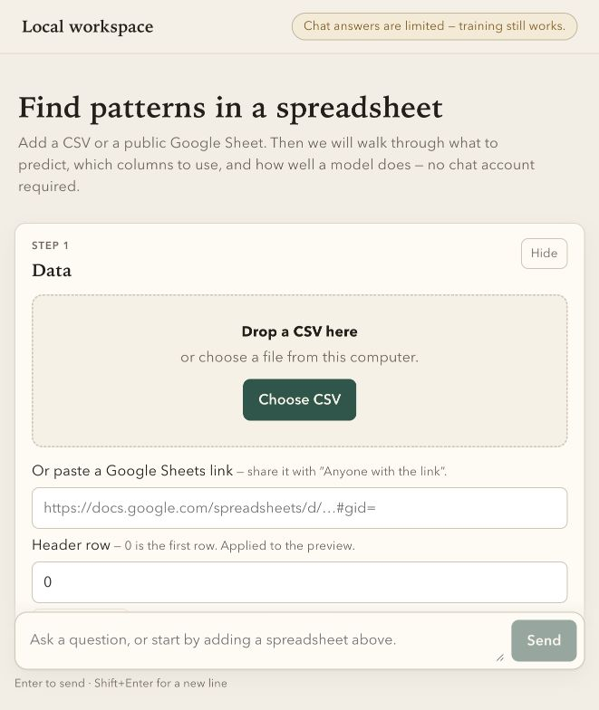
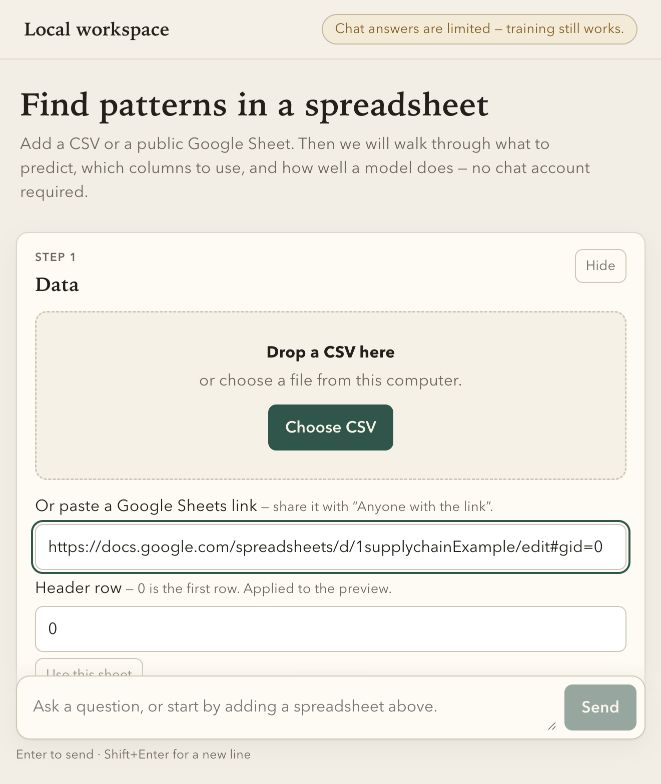
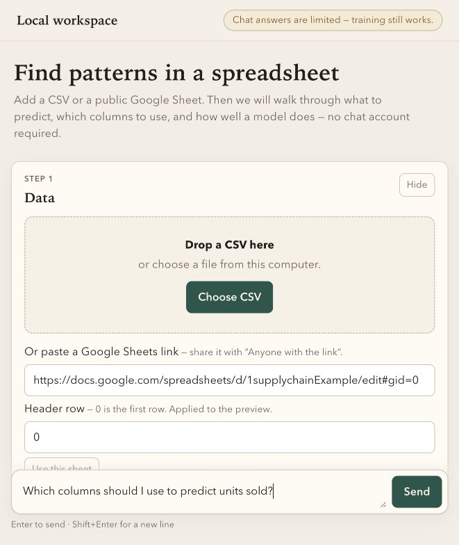

# mcp-cdp

Local AutoML workspace: CSV / public Google Sheets ingest, training jobs, predictions, chat, and MCP control. The modeling path works without an LLM key.

## Product tour

The workspace starts with a guided data card for CSV uploads and public Google Sheets links. The flow keeps the next decision visible for non-technical users.



Paste a Google Sheets link shared with “Anyone with the link” and review the selected tab before connecting it.



The chat window sits alongside the guided cards, so users can ask about columns, targets, metrics, and model results in plain language.



## Requirements

- Python 3.11+
- Node.js `20.19+` or `22.12+` (frontend only; required by Vite 8)
- On Apple Silicon, XGBoost needs an arm64 (or universal) `libomp.dylib`. Intel Homebrew’s `/usr/local/opt/libomp` will not load. Place the library at `$python_prefix/lib/libomp.dylib` or install ARM Homebrew `libomp` under `/opt/homebrew`. Training still runs dummy and linear candidates if XGBoost cannot load, and the report lists that candidate as not run.

## Install

```bash
python3.11 -m venv .venv
source .venv/bin/activate
pip install -e ".[dev]"
```

Copy `.env.example` to `.env` and set keys you use. Never commit `.env`.

| Variable | Purpose |
|---|---|
| `HOST` / `PORT` | Bind address. Forced to loopback; default `127.0.0.1:8765`. Ports 3000 and 8000 are rejected. |
| `DATA_DIR` | SQLite, uploads, and artifacts (default `data/`). |
| `MCP_TOKEN` | Bearer token for MCP. Required for `/mcp`; generate a long random value. Leave empty to keep MCP closed. |
| `MCP_IMPORT_ROOTS` | Comma- or path-separator-delimited directories that the stdio MCP bridge may read with `import_local_file`. |
| `OPENAI_API_KEY` | Optional chat. |
| `ANTHROPIC_API_KEY` | Optional chat. |

Keys are never logged or returned by `/api/status`.

## Run

Backend (loopback only):

```bash
uvicorn app.main:app --host 127.0.0.1 --port 8765
```

Or `mcp-cdp` after install.

Frontend (Vite, port **5173**, proxies `/api` to `http://127.0.0.1:8765`):

```bash
cd frontend
npm install
npm run dev
```

Open `http://127.0.0.1:5173`.

## Tests

```bash
PYTHONDONTWRITEBYTECODE=1 .venv/bin/pytest -q -p no:cacheprovider
cd frontend
npm ci
npm run typecheck
npm run test
npm run build
npm run lint
```

CSV ingest, Google Sheets (httpx mocked), jobs, and origin checks live under `tests/`.

## Limits

- Upload 50 MB
- 100_000 rows
- Job queue 10, one running training/predict job
- Forecast horizon 1–90, at most 100 series

## MCP

HTTP: `http://127.0.0.1:8765/mcp` with `Authorization: Bearer $MCP_TOKEN`. The app must already be running. Do not start a second worker.

Codex (`~/.codex/config.toml`):

```toml
[mcp_servers.mcp-cdp]
url = "http://127.0.0.1:8765/mcp"
bearer_token_env_var = "MCP_TOKEN"
```

Claude Code:

```bash
claude mcp add --transport http mcp-cdp http://127.0.0.1:8765/mcp \
  --header "Authorization: Bearer ${MCP_TOKEN}"
```

Claude Desktop uses the stdio bridge. Add this entry to `claude_desktop_config.json`, using absolute paths:

```json
{
  "mcpServers": {
    "mcp-cdp": {
      "command": "/absolute/path/to/mcp-cdp/.venv/bin/python",
      "args": ["-m", "app.mcp.stdio_bridge"],
      "env": {
        "MCP_TOKEN": "your-token",
        "MCP_IMPORT_ROOTS": "/absolute/path/to/imports"
      }
    }
  }
}
```

Design docs live under `design/`. The 100-question release checklist is `design/eval-questions.md`.
