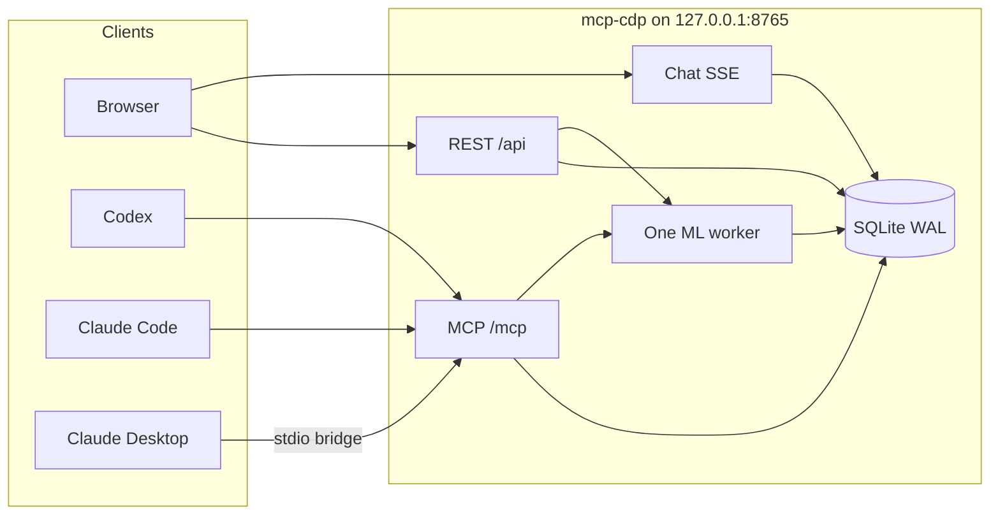

# System architecture

mcp-cdp is a complete local AutoML product: one process on loopback, one SQLite file, one ML worker, a browser UI, and an MCP surface that controls the same services as REST. It does not import `data-platform` or any other sibling repository. Predictions in that other product are inference heuristics (token overlap, lexicons, LLM structured outputs). This product fits dummy, regularized linear, and XGBoost models on the user's table, stores the fitted pipeline, and scores new rows with it.

This document is the architecture specification. Release Pass/Fail is recorded only in [eval-questions.md](eval-questions.md).

## Process

`app.main:create_app()` builds a single FastAPI application and binds **`127.0.0.1:8765`**. Ports 3000 and 8000 are never used. The process owns:

1. SQLite initialization (WAL, foreign keys on, default project `Local workspace`).
2. Platform REST routers under `/api`.
3. Chat router when present (`/api/conversations*`).
4. MCP ASGI app mounted at `/mcp` with `streamable_http_path="/"`. After `streamable_http_app()` is created, lifespan **must** run `mcp.session_manager.run()`.
5. Exactly one worker: at most one running ML job, at most ten queued jobs.
6. Optional static mount of `frontend/dist` at `/`.

Console entry points:

| Script | Role |
|---|---|
| `mcp-cdp` | HTTP app on `127.0.0.1:8765` |
| `mcp-cdp-stdio` | Stdio bridge that forwards to `http://127.0.0.1:8765/mcp` |

The stdio bridge does not start a second worker or a second database. Logs from the bridge go to stderr only.

In development the Vite app on **5173** proxies `/api` to `http://127.0.0.1:8765`. Production-style use serves `frontend/dist` from the same loopback process.



## Directory layout at runtime

| Path | Contents |
|---|---|
| `data/mcp_cdp.sqlite` | Catalog, jobs, chat, disclosure flags |
| `data/datasets/<dataset_id>/` | Original upload and normalized table |
| `data/artifacts/<job_id>/` | Fitted pipeline and job outputs |
| `data/artifacts/<job_id>/plots/` | Report figures |

Backup and restore are copies of `data/` taken while the process is stopped. Secrets (provider keys, `MCP_TOKEN`) live in the environment, never in SQLite.

## SQLite

Tables and column names are exactly those in [CONTRACT.md](CONTRACT.md). JSON is stored as TEXT. Foreign keys are on. The worker claims jobs with `attempt_id`, `lease_until`, and `heartbeat_at`, then **releases the database transaction before training**. Training must not hold a write transaction open.

Core entities:

- **projects** — one default row named `Local workspace`. The product is single-user; project-scoping still exists so REST and MCP share the same identifiers.
- **datasets / dataset_versions** — immutable versions: original bytes path, normalized path, content hash, row/col counts, encoding, delimiter, header row, import metadata.
- **sheet_connections** — public Google Sheets link, selected tab, last status/check/error, last version.
- **columns** — inferred role, optional user role, missing/unique/constant stats, sample preview for the UI (not sent to the LLM unless disclosure is on).
- **experiments / experiment_revisions** — each submit freezes `config_json`. Later UI edits do not mutate a submitted revision.
- **jobs** — `train` or `predict`; status `queued|running|succeeded|failed|canceled`.
- **models / reports / predictions** — fitted artifact, metrics, plots, prediction file.
- **conversations / messages** — chat transcript with `client_id` uniqueness and message status.
- **sample_disclosure** — per-dataset opt-in for raw samples.

## Worker

One in-process worker loop:

- Queue depth 10. An eleventh submit is rejected with a visible saturation error on REST and MCP.
- At most one job in `running`.
- Claim uses `attempt_id` + lease. Heartbeats refresh `heartbeat_at` and `lease_until`.
- Cancel is cooperative and must remain responsive during training: the control API is not blocked by the ML subprocess.
- On process death, a job whose lease expired may be retried with a new `attempt_id`. A succeeded job never republishes artifacts from a stale worker.
- Progress is written to `progress_json` and streamed on `GET /api/projects/{id}/jobs/{id}/events` as SSE objects `{type, ...}`.

The worker calls the ML interface only:

```python
def run_train(job: dict, paths: dict) -> dict: ...
def run_predict(job: dict, paths: dict) -> dict: ...
```

`app.ml` must not import `app.api`, `app.mcp`, `app.services.chat`, `openai`, or `anthropic`. An automated import linter enforces that (eval question 9).

## REST

Prefix `/api`. Mutating cookie-session routes are CSRF-protected: SameSite=Lax plus origin check. The local UI sends `X-Requested-With: mcp-cdp`.

| Method | Path | Result |
|---|---|---|
| GET | `/api/health` | `{ok:true}` |
| GET | `/api/status` | `{llm_configured, provider, mcp_token_set}` — never keys |
| GET/POST | `/api/projects` | List / create |
| POST | `/api/projects/{id}/datasets/upload` | Multipart `file` |
| POST | `/api/projects/{id}/datasets/sheets` | `{url, gid?, header_row?, name?}` |
| POST | `/api/projects/{id}/sheet-connections/{id}/refresh` | Manual refresh |
| GET | `/api/projects/{id}/datasets` | List |
| GET | `/api/projects/{id}/datasets/{id}` | Current version + profile summary |
| GET | `/api/projects/{id}/datasets/{id}/preview?n=20` | Preview |
| PUT | `/api/projects/{id}/datasets/{id}/columns` | `{columns:[{name, role}]}` |
| POST | `/api/projects/{id}/experiments` | `{dataset_id, config}` |
| POST | `/api/projects/{id}/experiments/{id}/submit` | `{job_id, status:"queued"}` immediately |
| GET | `/api/projects/{id}/jobs/{id}` | Job snapshot |
| GET | `/api/projects/{id}/jobs/{id}/events` | SSE |
| POST | `/api/projects/{id}/jobs/{id}/cancel` | Cancel |
| GET | `/api/projects/{id}/reports/{job_id}` | Report |
| POST | `/api/projects/{id}/predict` | Multipart or `{model_id, dataset_id}` → `{job_id}` |
| GET | `/api/projects/{id}/predictions/{id}/download` | File |
| POST | `/api/conversations` | Start |
| GET | `/api/conversations/{id}/messages` | History |
| POST | `/api/conversations/{id}/messages` | `{content, client_id}` → SSE |

Limits enforced server-side: **50 MB**, **100,000 rows**, **100 forecast series**, **horizon 1–90**.

REST handlers call domain services. They do not reimplement ingest, job, or ML rules that MCP also needs.

## MCP

Mounted at `/mcp`. Authentication is `Authorization: Bearer` from env `MCP_TOKEN`. Bind remains loopback.

Tools (project-scoped except `list_projects`):

`list_projects`, `get_project`, `list_datasets`, `inspect_dataset`, `get_profile`, `get_report`, `connect_google_sheet`, `refresh_google_sheet`, `configure_experiment`, `submit_training`, `get_job`, `cancel_job`, `submit_predict`, `import_local_file` (stdio only).

Writes require `confirm: true`. Long jobs return `{job_id}` immediately. Equivalent REST and MCP operations produce equivalent configs, validation outcomes, and artifacts. See [chat-and-mcp.md](chat-and-mcp.md).

## Frontend

Vite + React + TypeScript in `frontend/`. Chat is the center. Guided cards, in order:

1. Data
2. What to predict
3. Columns
4. Confirm & train
5. How good is it?
6. Predict

Copy is non-technical. CSV is drag-and-drop and a file picker. Sheets is a URL field. Empty and error states are honest. The modeling path does not require an LLM key.

## Data flow

### Import

1. User drops a CSV or pastes a public Sheets URL (`Anyone with the link`).
2. Service stores original bytes under `data/datasets/<dataset_id>/`.
3. Parser records encoding, delimiter, header row. Identifier-like values such as `00123` stay text until the user chooses numeric.
4. A `dataset_versions` row is inserted with content hash, original path, normalized path, and `import_meta_json`.
5. Profiler fills `columns` (roles, missing, unique, constant, preview).
6. Sheets: the user URL is **never fetched**. The service parses spreadsheet id and gid, then GET `https://docs.google.com/spreadsheets/d/{id}/export?format=csv&gid={gid}` on an allowlist (`docs.google.com`, `spreadsheets.google.com`, `*.googleusercontent.com`). Login wall / 401 / 403 → `private`. 404 → `revoked`. Same canonical CSV hash → no new version. Refresh is manual.

### Train

1. User (or MCP client) sets task, target, roles, split, budget.
2. `POST .../experiments` stores config; `POST .../submit` freezes an `experiment_revisions` row and enqueues a `train` job. The HTTP/MCP response is `{job_id, status:"queued"}` without waiting for fit. Classification/regression hold out 20% of rows; forecast holds out the configured horizon, not 20% (see [data-and-ml.md](data-and-ml.md)).
3. Worker claims the job, calls `run_train`, writes artifacts, models, reports, plots.
4. UI and MCP read job SSE / snapshots, then the report.

### Predict

1. User supplies a file or dataset plus `model_id`.
2. `POST .../predict` enqueues a `predict` job.
3. Worker calls `run_predict` with the stored pipeline. Output keeps input row order and identifier strings. Download is `GET .../predictions/{id}/download`.

### Chat

1. User message is persisted **before** generation (`client_id` idempotent).
2. Assistant row starts as `streaming`, then `complete` / `interrupted` / `failed`.
3. Default model context is schema, aggregates, experiment settings, and computed metrics. Raw samples only if `sample_disclosure.enabled` after an explicit preview. CONTRACT defines that table and policy but no REST/MCP write; see [chat-and-mcp.md](chat-and-mcp.md).
4. At most six tool calls per turn, all hitting the same services as REST.
5. If no provider key is configured, chat says so and points at the cards. Training still works.

## Trust boundary

- Loopback only.
- Cookie CSRF + origin check for the UI.
- MCP bearer token; no MCP tools for shell, SQL, code execution, or unrestricted URL fetching.
- LLM keys stay in process environment. `/api/status` reports booleans and provider name, never secrets.
- Sheets fetch is allowlisted and does not follow the user's raw URL.

## Relation to other products

`data-platform` (UDIP) is a multi-tenant intelligence suite. Its prediction module scores with LLM structured outputs and lightweight heuristics; it is not a leakage-safe fit of sklearn/XGBoost on a local table. mcp-cdp exists so that classification, regression, and grouped SKU+store forecasting are **trained and stored for real**, on one machine, without that stack.
